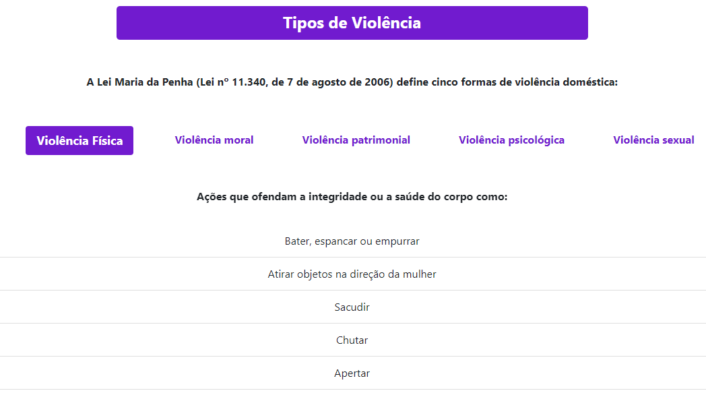
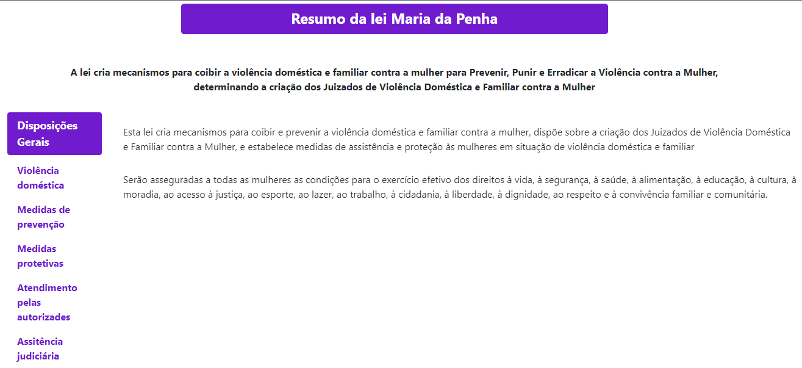
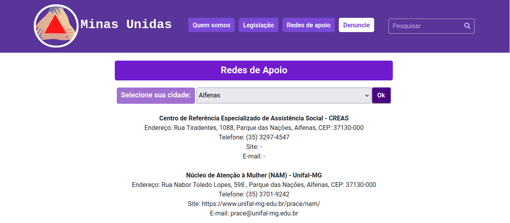
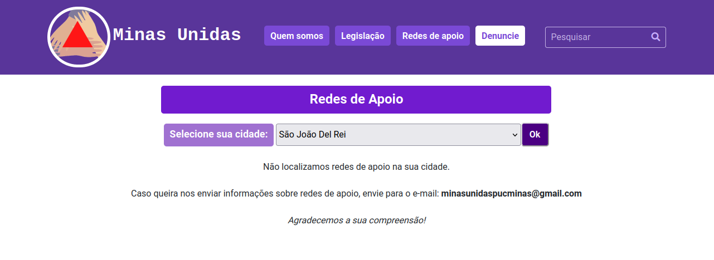
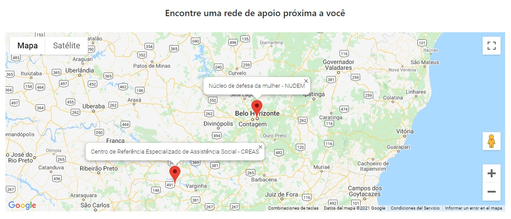
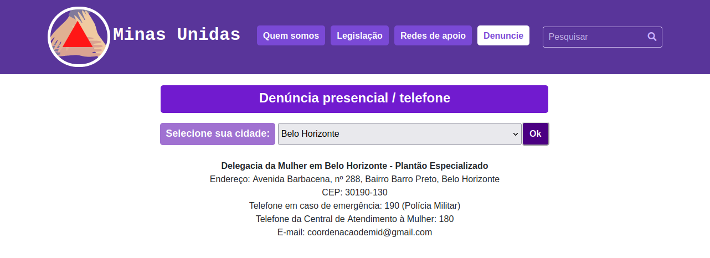
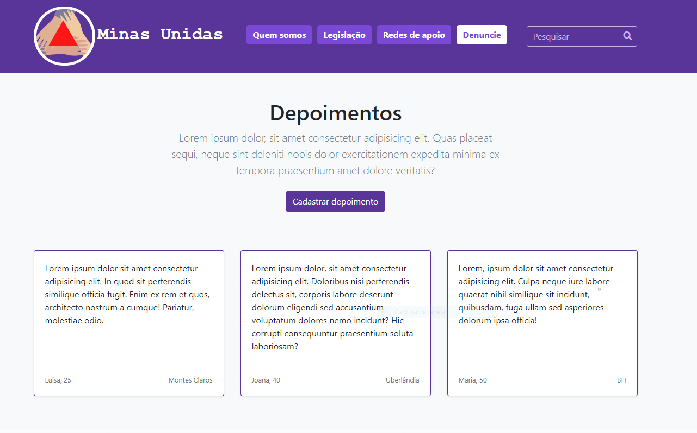
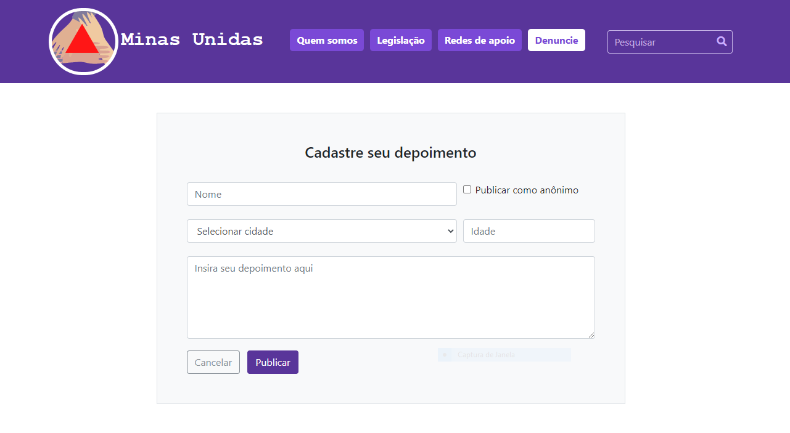
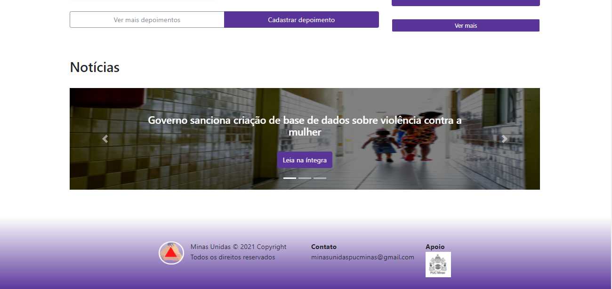

<div align="justify"> 
  
# Programação de Funcionalidades

Nesta seção estão descritos os artefatos e estruturas de dados criados para atender aos requisitos previstos nas <a href="./especification.md">Especificações do Projeto</a>, bem como as instruções para acesso e verificação da implementação. As tecnologias utilizadas se baseiam nas linguagens HTML, CSS e JavaScript.

## Legislação

### Requisitos

- RF-001 - Disponibilizar área com informações sobre a violência contra a mulher e os tipos de violência
- RF-002 - Disponibilizar área com informações de leis referentes a violência contra a mulher

Para atender aos requisitos RF-001 e RF002 foi desenvolvido a página Legislação.

Ao acessar a página Legislação, será exibo menu descrevendo os tipos de violência definidos pela Lei Maria da Penha:
  

  
Foi desenvolvido um menu de opções do tipo `nav-pills` horizontal que contém botões do tipo `nav-link`.

Ao clicar nos botões, o site verifica a lista da tabela do tipo `tab-pane` e retorna os dados de acordo com o tipo de violência selecionado.

<br/>

Logo abaixo é exibido o resumo da Lei Maria da Penha:
  


Foi desenvolvido um menu de opções do tipo `nav-pills` vertical que contém botões do tipo `nav-link`. 

Ao clicar nos botões, o site verifica a lista da tabela do tipo `tab-pane` e retorna os dados de acordo com a sessão da Lei Maria da Penha que foi selecionada.

No final da página foi disponibilizado o botão `Faça sua denúncia` onde ao clicar, direciona para a página `/src/denuncie.html`:


Também foi disponibilizado o botão `Leia a lei na íntegra`, onde ao clicar, o usuário será direcionado em uma nova aba para o link `http://www.planalto.gov.br/ccivil_03/_ato2004-2006/2006/lei/l11340.htm` contendo a descrição completa da Lei Maria da Penha:


  
<br/>


## Instituições de apoio e denúncia

### Requisitos

- RF-003 - Disponibilizar área com informações sobre instituições de apoio a mulheres vítimas de violência
- RF-006 - Disponibilizar funcionalidade que permita pesquisar instituições de apoio
  
<br/>

As páginas "Redes de apoio" e "Denuncie" apresentam uma lista de opções com 58 cidades do estado de Minas Gerais. 

Na página "Redes de apoio", ao selecionar uma cidade, a function implementada no arquivo `src/js/rede-apoio.js` é executada e exibe a(s) rede(s) de apoio da cidade:
  


Para as cidades que não possuem redes de apoio, uma mensagem padrão é exibida na tela:



Na mesma página de redes de apoio, implementamos a API "Maps JavaScript" do google que nos permite posicionar dentro do estado de Minas Gerais a localização das redes de apoio listadas. Através do clique em cada marcador é possível consultar informações básicas sobre a instituição.



Na página "Denúncia presencial/telefone", ao selecionar uma cidade, a function implementada no arquivo `src/js/denuncie-presencial.js` é executada e exibe a delegacia da mulher da cidade:



Nos dois arquivos js citados, a estrutura de dados utilizada é JSON, conforme exemplo a seguir:

```  
var textoJSON = `{ "redesapoio": [
        { 
         "Instituição1": "<b>Centro de Referência Especializado de Assistência Social - CREAS</b>", 
        "Endereço1": "Endereço: Rua Tiradentes, 1088, Parque das Nações, Alfenas, CEP: 37130-000", 
        "Site1": "Site: -", 
        "Email1": "E-mail: -", 
        "Telefone1": "Telefone: (35) 3297-4547", 
        "Instituição2": "<b>Núcleo de Atenção à Mulher (NAM) - Unifal-MG</b>", 
        "Endereço2": "Endereço: Rua Nabor Toledo Lopes, 598 , Parque das Nações, Alfenas, CEP: 37130-000", 
        "Site2": "Site: https:\/\/www.unifal-mg.edu.br\/prace\/nam\/", 
        "Email2": "E-mail: prace@unifal-mg.edu.br", 
        "Telefone2": "Telefone: (35) 3701-9242"
        }
  ]
  }`
```
  
## Depoimentos

### Requisitos

- RF-004 - Disponibilizar página em que o usuário poderá inserir depoimentos
- RF-005 - Disponibilizar página em que o usuário poderá ler os depoimentos
- RF-007 - Disponibilizar funcionalidade que permita definir perfil de usuário anônimo ou identificado para depoimento
  
<br/>

Na página "Depoimentos", o usuário pode visualizar todos os depoimentos já cadastrados no site.



Os depoimentos já cadastrados são exibidos por meio de uma função que acessa os dados armazenados no arquivo `src/js/depoimentos.js`. Este arquivo contém uma estrutura de dados baseada em JSON que armazena nome, idade, cidade e depoimento dos usuários no localStorage do navegador. Assim, foi atendido o **RF-005 (Disponibilizar página em que o usuário poderá ler os depoimentos)**.

<br/>

```
var db  = {
    data: [
        {
            nome: 'Maria',
            idade: 50,
            cidade: 'Belo Horizonte',
            texto: 'Lorem, ipsum dolor sit amet consectetur adipisicing elit.'
        }
    ]
}
```

<br/>

Por meio da página Depoimentos, também é possível acessar a página com o formulário para cadastro de novos depoimentos.



No formulário de cadastrado, é oferecida ao usuário a opção de registrar o seu depoimento de forma anônima, atendendo ao **RF-007 (Disponibilizar funcionalidade que permita definir perfil de usuário anônimo ou identificado para depoimento)**.


Após o envio do formulário, é exibido um modal com mensagem informando o sucesso no envio:


Os dados cadastrados são registrados no localStorage do navegador de acordo com a estrutura de dados presente em `src/js/depoimentos.js` apresentada anteriormente. Com esta funcionalidade, é atendido o **RF-004 (Disponibilizar página em que o usuário poderá inserir depoimentos)**.

## Notícias

### Requisitos
- RF-009 - Disponibilizar sessão com últimas notícias relacionadas pertinentes ao tema de violência contra a mulher

<br/>
  
No final da homepage/index, o usuário pode visualizar um carrossel de notícias relacionadas ao conteúdo de violência contra a mulher, passando as notícias de 8 em 8 segundos, cada uma contando com um botão que leva à íntegra da notícia.



</div>

<hr>
 
<p align="right"><a href="./template.md">Template Padrão</a> | <a href="./tests.md">Testes de Software</a></p>
