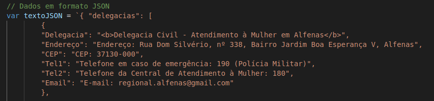

<div align="justify"> 
  
# Programação de Funcionalidades

Nesta seção estão descritos os artefatos e estruturas de dados criados para atender aos requisitos previstos nas <a href="./especification.md">Especificações do Projeto</a>, bem como as instruções para acesso e verificação da implementação. As tecnologias utilizadas se baseiam nas linguagens HTML, CSS e JavaScript.

## Legislação

### Requisitos

- RF-001 - Disponibilizar área com informações sobre a violência contra a mulher e os tipos de violência
- RF-002 - Disponibilizar área com informações de leis referentes a violência contra a mulher

Inserir texto.

## Instituições de apoio

### Requisitos

- RF-003 - Disponibilizar área com informações sobre instituições de apoio a mulheres vítimas de violência
- RF-006 - Disponibilizar funcionalidade que permita pesquisar instituições de apoio

As páginas "Redes de apoio" e "Denuncie" apresentam uma lista de opções com 58 cidades do estado de Minas Gerais. 

Na página "Redes de apoio", ao selecionar uma cidade, a function implementada no arquivo `src/js/rede-apoio.js` é executada e exibe a(s) rede(s) de apoio da cidade:
  


Para as cidades que não possuem redes de apoio, uma mensagem padrão é exibida na tela.:


Na página "Denúncia presencial/telefone", ao selecionar uma cidade, a function implementada no arquivo `src/js/denuncie-presencial.js` é executada e exibe a delegacia da mulher da cidade:


Nos dois arquivos js citados, a estrutura de dados utilizada é JSON, conforme imagem a seguir:

  

## Depoimentos

### Requisitos

RF-004 - Disponibilizar página em que o usuário poderá inserir depoimentos
RF-005 - Disponibilizar página em que o usuário poderá ler os depoimentos
RF-007 - Disponibilizar funcionalidade que permita definir perfil de usuário anônimo ou identificado para depoimento

Na página "Depoimentos", o usuário pode visualizar todos os depoimentos já cadastrados no site.


Os depoimentos já cadastrados são exibidos por meio de uma função que acessa os dados armazenados no arquivo `src/js/depoimentos.js`. Este arquivo contém uma estrutura de dados baseada em JSON que armazena nome, idade, cidade e depoimento dos usuários no localStorage do navegador. Assim, foi atendido o **RF-005 (Disponibilizar página em que o usuário poderá ler os depoimentos)**.

```
var db  = {
    data: [
        {
            nome: 'Maria',
            idade: 50,
            cidade: 'Belo Horizonte',
            texto: 'Lorem, ipsum dolor sit amet consectetur adipisicing elit.'
        }
    ]
}
```

Por meio da página Depoimentos, também é possível acessar a página com o formulário para cadastro de novos depoimentos.


No formulário de cadastrado, é oferecida ao usuário a opção de registrar o seu depoimento de forma anônima, atendendo ao **RF-007 (Disponibilizar funcionalidade que permita definir perfil de usuário anônimo ou identificado para depoimento)**.


Após o envio do formulário, é exibido um modal com mensagem informando o sucesso no envio:


Os dados cadastrados são registrados no localStorage do navegador de acordo com a estrutura de dados presente em `src/js/depoimentos.js` apresentada anteriormente. Com esta funcionalidade, é atendido o **RF-004 (Disponibilizar página em que o usuário poderá inserir depoimentos)**.

## Notícias

### Requisitos
- RF-009 - Disponibilizar sessão com últimas notícias relacionadas pertinentes ao tema de violência contra a mulher

Inserir texto.

</div>

<hr>
 
<p align="right"><a href="./template.md">Template Padrão</a> | <a href="./tests.md">Testes de Software</a></p>