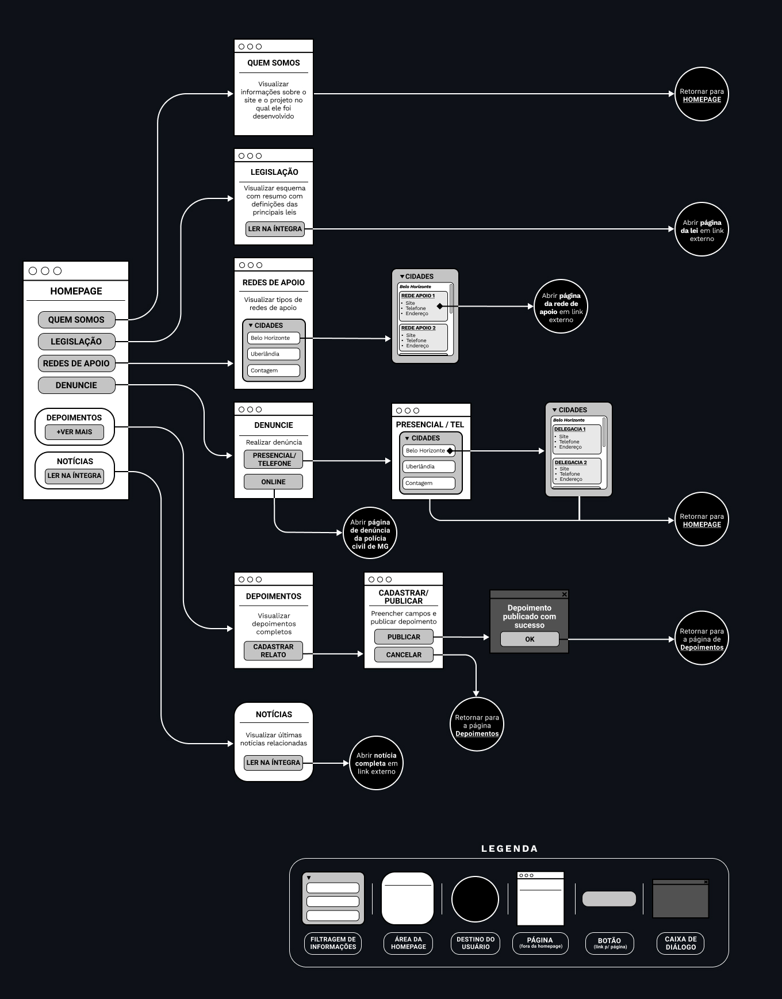
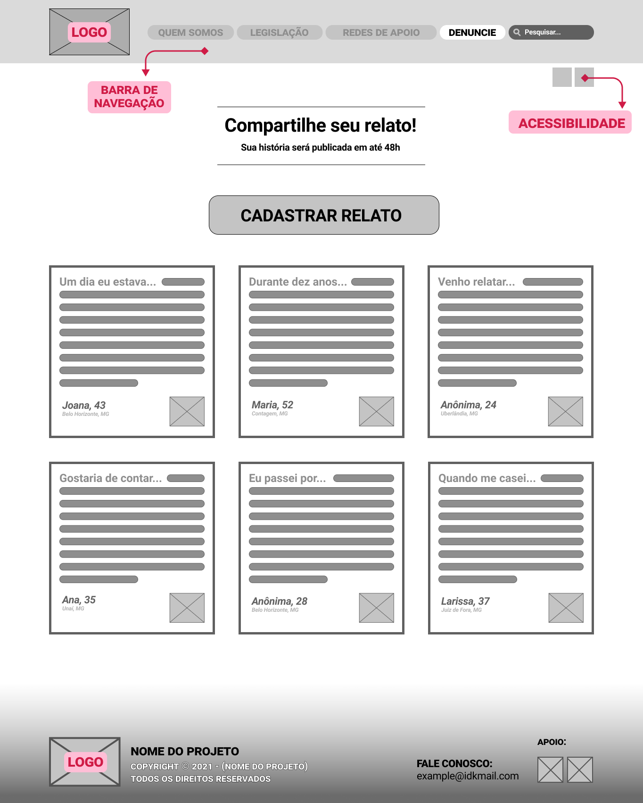
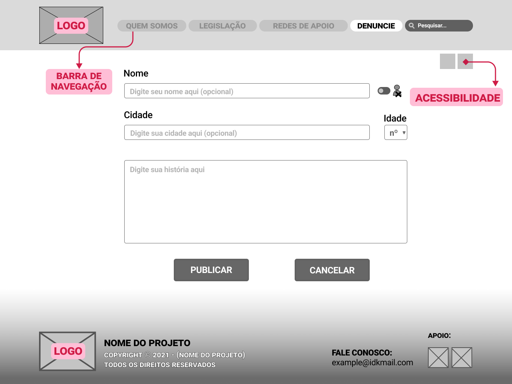
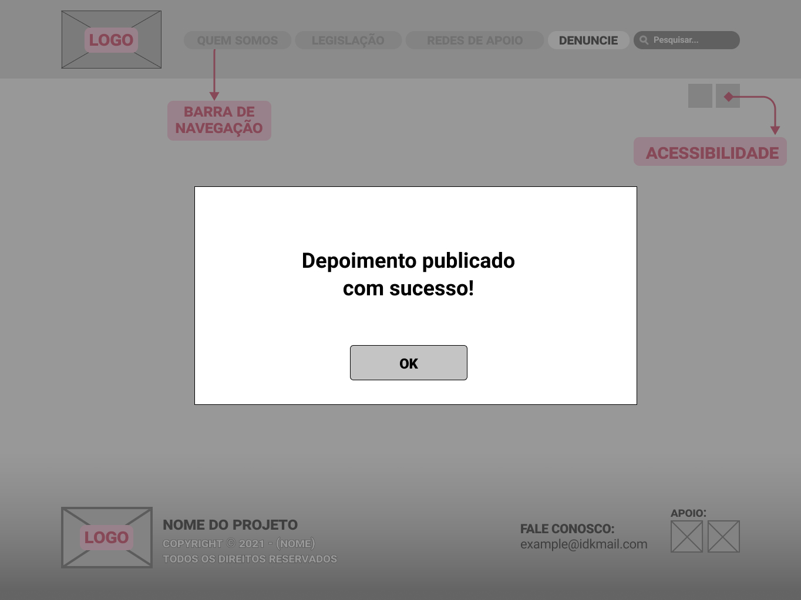
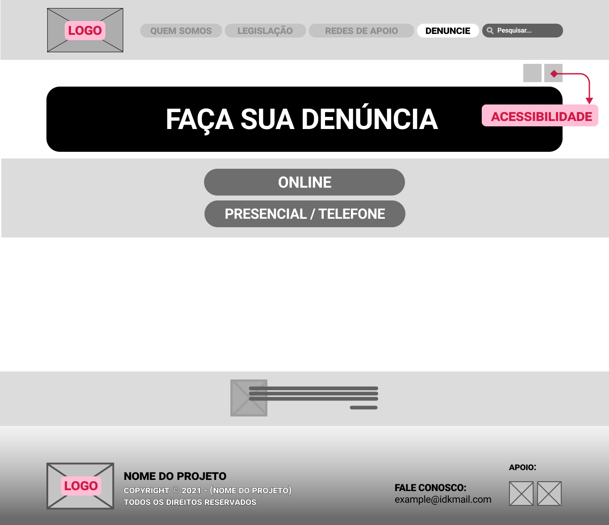
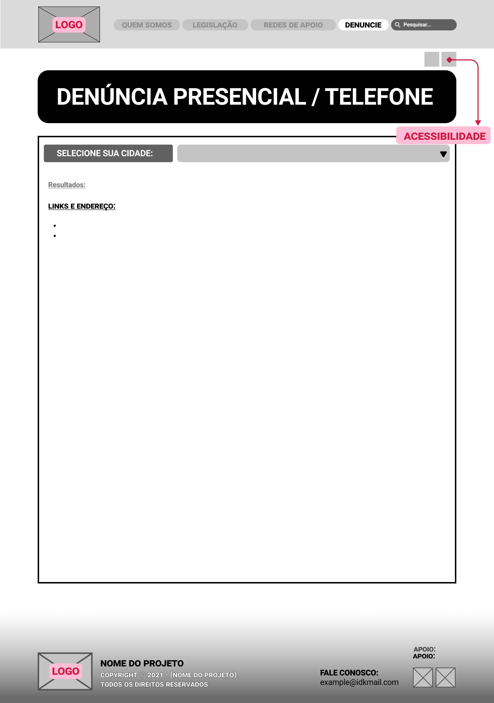

# Projeto de Interface

 
*Parágrafo Homepage:*
 

*Parágrafo “Quem Somos”:* Através da homepage, no menu de navegação é possível acessar a opcao "QUEM SOMOS" que leverá o usuário até a página de identificacao do projeto.  Na página é possível conhecer aspectos do projeto como missao, história, integrantes e iniciativas implementadas.

*Parágrafo “Legislação”:*
A partir da Homepage, utilizando o menu de navegação, o usuário irá clicar no botão "Legislação" para acessar a página de contém informações legais sobre a violência contra a mulher. Ao acessar a página, será exibido ao usuário informações sobre os cinco tipo de violência: física, moral, patrimonial, psicológica e sexual. Percorrendo a página também estará disponível resumo das leis vigentes referentes ao tema. Ao final, estará disponível o botão "Ler na íntegra" onde, ao clicar, abrirá uma nova aba no navegador direcionando para o site do governo onde estará disponível a versão completa da lei.

  
 

## User Flow

## Wireframes

 
 ### Depoimentos:

Ao clicar no botão da homepage "Ver mais depoimentos", o usuário será redirecionado para a página "Depoimentos", onde poderá ler todos os depoimentos já registrados no site, conforme RF-005. Nesta página "Depoimentos", há o botão "Cadastrar relato".

Ao clicar no botão "Cadastrar relato", o usuário será redirecionado para uma página com o formulário de cadastro de depoimentos e dois botões: "Publicar" e "Cancelar". Se o usuário clicar no botão "Cancelar", retornará para a página "Depoimentos".

Caso o usuário tenha clicado no botão "Publicar" na página anterior, abrirá uma caixa de diálogo com a mensagem "Depoimento publicado com sucesso!" e o botão "OK". Desta forma, será atendido o RF-004.

### Denúncia: 
 
A partir da homepage, é possível clicar no card “Faça sua denúncia” ou no botão “Denuncie” na barra de navegação para acessar a página “Faça sua denúncia”. Nesta página, há dois botões: “Minas Gerais: denúncia online” e “Minas Gerais: denúncia presencial/telefone”. Ao clicar no primeiro botão,  a usuária será redirecionada para o link externo da Delegacia Virtual da Polícia Civil de Minas Gerais.

Ao clicar no segundo botão, a usuária será direcionada para a página “Minas Gerais: denúncia presencial / telefone” na qual será apresentada uma lista suspensa para selecionar a cidade desejada. Após selecionar a cidade, serão exibidas na mesma página as delegacias da cidade, endereços, telefones e sites.

 
### Redes de Apoio:
 
Na homepage há a opção para clicar no botão "Rede de Apoio", ao clicar neste botão o usuário será levado a página onde consta já no início, uma apresentação sobre o tema. Logo abaixo, há tópicos com resumos explicando cada um dos serviços abordados na Rede de Apoio, estando disponibilizado também links relacionados por serviço, que ao clicar redirecionará o usuário para uma página externa de instituições como casa de apoio, escritório jurídico, apoio psicológico e outros serviços oferecidos, sendo possível fazer essa busca através dos filtros no início da página.

 

 
 

 

<a href="./especification.md">Especificação do Projeto</a> | <a href="./template.md">Template Padrão</a>

